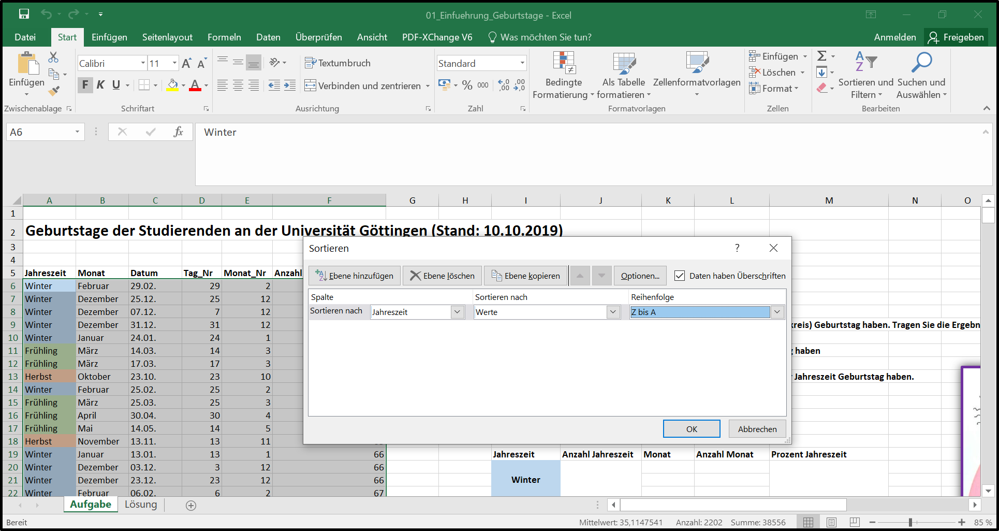

Für die Übungen im Modul Quantitative Methoden I benötigen Sie das Tabellenkalkulationsprogramm __Microsoft Excel__. Sofern Sie Excel nicht bereits auf Ihrem Rechner nutzen, können Sie als Studierende das Programm günstig über eine Uni-Lizenz erwerben (auch für andere Programme gibt es Campus-Lizenzen). Klicken Sie dazu einfach [hier](https://www.uni-goettingen.de/de/campuslizenzen+%26dash%3B+software+f%C3%BCr+studierende/624709.html).

Eine frei verfügbare Alternative zu Microsoft Excel ist das Programm __Libre Office Calc__, welches Sie [hier](https://de.libreoffice.org/discover/calc/) herunterladen können. Auch mit Libre Office Calc kann man die meisten Dinge machen. Die Übungen in diesem Seminar werden aber trotzdem mit Excel durchgeführt.

 

 

# Erste Schritte - die Exceloberfläche

Wenn Sie Excel installiert haben und öffnen, sieht die Oberfläche zunächst so aus, wie in dem Bild unten. 

Sie haben hier die Möglichkeit, aus verschiedenen "Vorlagen" zu wählen, bereits existierende Dateien aus einem Ordner heraus zu öffnen, oder ein neues Dokument zu beginnen. Excel-Dokumente heißen __Arbeitsmappen__. Um eine neue Arbeitsmappe zu erstellen, klicken Sie ganz einfach auf __Leere Arbeitsmappe__.

 

{width=70%}
 
 

## Die Arbeitsmappenansicht

Nachdem sie auf "Leere Arbeitsmappe" geklickt haben, gelangen Sie zur Arbeitsmappenansicht, die so aussieht, wie im Bild unten dargestellt. Im Wesentlichen sieht eine Arbeitsmappe aus wie eine riesige Tabelle, in der es jede Menge __Spalten__ und __Zeilen__ gibt. Spalten sind durch __Buchstaben__ (A, B, C, ...) und Zeilen durch __Zahlen__ (1, 2, 3, ...) gekennzeichnet. Die Schnittstelle zwischen einer Spalte und einer Zeile nennt man in Excel __Zelle__. Durch die Spalten- und Zeilenbeschriftungen kann also jede Zelle eindeutig benannt werden. Im Bild unten sind zur Verdeutlichung zwei Zellen rot markiert. Zum Beispiel befindet sich die erste rot markierte Zelle Spalte __R__ und dort wiederum in Zeile __3__. Diese Zelle heißt also __R3__. 

 
 

Sie können mit Ihrer Maus in eine beliebe Zelle klicken. Die Zelle, die Sie anklicken, wird dann zur besseren Orientierung durch einem grünen Rahmen markiert. Wie Sie sehen können, ist im Bild die Zelle __A1__ markiert.

Sie können dann Einträge in eine ausgewählte Zelle hineinschreiben. Solche Einträge können entweder __Text__ oder __Zahlen__ sein. In den meisten Fällen werden wir dort natürlich Zahlen vorfinden, denn wir wollen ja in diesem Seminar Excel benutzen, um zu rechnen und statistische Analysen durchzuführen. Text verwendet man in der Regel, um bestimmte Spalten, Zeilen, oder Zellen mit einer Beschriftung zu versehen.

 

# Eine erste Tabelle und eine erste Berechnung

__Beispiel -- Die Lebenserwartung von Eichhörnchen und Grauhörnchen:__ 

Wir könnten jetzt zum Beispiel eine kleine Tabelle erstellen, in der wir uns die Lebenserwartungen von amerikanischen Grauhörnchen und europäischen Eichhörnchen notieren. Diese Tabelle ist in der ersten Abbildung unten dargestellt. Wie Sie dort sehen können, beträgt die durschnittliche Lebenserwartung von Eichhörnchen drei Jahre (das steht in... genau, in Zelle __B2__) und die von Grauhörnchen zehn Jahre (Zelle __B3__). Ein ziemlich großer Unterschied. 

Das schöne an Excel ist, dass man damit nicht nur Dinge notieren, sondern auch damit __rechnen__ kann. Wir könnten jetzt z.B. die Differenz der zwei notierten Lebenserwartungen berechnen und das Ergebnis in Zelle __D3__ hineinschreiben. 

 
 

 

Um in Excel eine Rechnung durchzuführen (s. Bild 2), klickt man zunächst in die Zelle, in die dar Ergebnis geschrieben werden soll (in unserem Fall __D3__). Danach schreibt man in diese Zelle ein __Gleichheitszeichen__ (=); das ist für Excel nämlich das Signal, dass nun gerechnet werden soll. Wir könnten jetzt also in die Zelle __D3__ einfach Folgendes schreiben: $=10-3$. Wenn wir dann "Enter" drücken, wird das Ergebnis dieser Rechnung (7) in __D3__ geschrieben. Wir müssen die Zahlen 10 und 3 aber nicht aus unserer Tabelle ablesen und manuell eintragen. Wir können nach dem "=" auch einfach mit der Maus zuerst Zelle __B3__ anklicken, danach ein Minuszeichen (-) schreiben, und dann die Zelle __B2__ anklicken. In Bild 2 oben können Sie sehen, wie das aussieht.

Vielleicht fragen Sie sich jetzt, welchen Vorteil es haben könnte, statt den Zahlen lediglich die Koordinaten, __B3__ und __B2__, einzutragen (s. Bild 2). Ein leicht ersichtlicher Vorteil ist natürlich, dass man so vermeidet, sich zu vertippen und versehentlich eine falsche Zahl einzutragen (was bei großen Tabellen schnell passieren kann). 

Ein weniger offensichtlicher aber gewaltiger Vorteil ist, dass die Ergebniszelle (__D3__) auf diese Weise __"dynamisch"__ wird. Damit ist gemeint, dass sich das Ergebnis der Berechnung __automatisch anpasst__, wenn man in der Ausgangstabelle die __Werte verändert__. Stellen Sie sich vor, eine neue Studie hätte ergeben, dass europäische Eichhörnchen doch älter werden als zunächst gedacht (eine schöne Nachricht). Ändern Sie die "3" in eine "4". Was passiert mit der berechneten Differenz? Genau, das Ergebnis wird automatisch aktualisiert (6 statt 7). 

 

# Speichern einer Arbeitsmappe

Eine so wichtige Tabelle wie unsere Hörnchenlebenserwartungstabelle darf natürlich auf keinen Fall verloren gehen. Deshalb sollte man wissen, wie man Arbeitsmappen __abspeichern__ kann. Das funktioniert in Excel wie mit den meisten Programmen, die Sie schon kennen.Klicken Sie oben im __grünen Bereich__ des Programms auf __Datei__. In dem erscheinenden Menü finden Sie die Auswahl __"Speichern unter"__. Damit können Sie die gegenwärtige Arbeitsmappe in einem beliebigen Ordner Ihres Rechners speichern. Am besten erstellen Sie sich einen neuen Ordner, den Sie "Quanti 1" nennen. Dort können Sie dann alle Excel-Dateien, die Sie im Verlauf dieses Semesters erstellen werden, sammeln.

 

{width=70%}
 
 

# Ein etwas komplexeres Beispiel

Nachdem Sie sich nun ein wenig mit der Excel-Umgebung vertraut gemacht haben, wollen wir uns jetzt zum Ende dieser Einführungssitzung noch ein etwas umfangreicheres Beispiel ansehen.

__Die Geburtstage der Studierenden im Wintersemester 19/20:__

Im Bild unten sehen Sie eine ziemlich große Tabelle, in der die Gebutstagsdaten aller Studierenden der Uni Göttingen aufgelistet sind, die zum Zeitpunkt des 10.10.2019 an der Universität immatrikuliert gewesen waren (selbstverständlich alles anonymisiert). Mit Hilfe der Daten in dieser Tabelle wollen wir uns jetzt noch einige sehr nützliche Excel-Funktionen ansehen.

Sie müssen sich diese Tabelle nicht selbst erstellen. Sie finden alle Materialen  [hier](https://quantigoettingen.github.io/quantigoettingen/page-q1_materials.html) und alternativ auch in stud.ip. 

 

{width=100%}
 
 

In Spalte __C__ stehen die verschiedenen Geburtstagsdaten, in Spalte __B__ der dazugehörige Monat und in Spalte __A__ die dazugehörige Jahreszeit. In Datumsspalte __C__ ist über die Spalten __D__ und __E__ noch einmal aufgeteilt (in Tag und Monat). Spalte __F__ gibt an, wie viele Studierende an einem bestimmten Tag Geburstag haben.

Weiter rechts in der Arbeitsmappe sehen Sie eine Reihe von __Aufgaben__. Darunter befindet sich eine vorgefertigte Tabelle, in die die Ergebnisse eingetragen werden sollen. Wir werden jetzt die Aufgaben Schritt für Schritt durchgehen.

 

__TIPP:__ _Ganz unten auf der Seite finden Sie auch ein Tutorial-Video, in dem wir einen Teil der Lösung der Aufgaben besprechen. Bevor Sie das Video schauen, sollten Sie aber zunächst weiterlesen._

 
 

## Aufgabe 1) Wie viele Studierende waren im WiSe 2019/2020 eingeschrieben?

__Die erste Excel-Funktion:__

Das Ergebnis soll in Zelle __J33__ geschrieben werden, also in die Zelle rechts neben der Zelle, die __"Gesamtanzahl"__ heißt. Eine Gesamtzahl lässt sich in Excel sehr schnell mit Hilfe der so genannten __"Summenfunktion"__ ermitteln. Die Summenfunktion ist die erste __Excel-Funktion__, die Sie jetzt kennenlernen werden. Die Notation der Funktion ist __=SUMME()__. 

So gehts: klicken Sie in Zelle __J33__ und schreiben Sie wieder "$=$". Schreiben Sie unmittelbar dahinter "__SUMME__" und öffnen sie eine runde Klammer, "__(__". Markieren Sie nun mit ihrer Maus (klicken und gedrückt halten) den Spaltenbereich in Spalte __F__, in der die Anzahlen der Studierenden aufgelistet sind.Sie sollten einen farbigen Rahmen um diesen Spaltenbereich herum sehen. Danach beenden Sie die begonnende Funktion mit einer geschlossenen Klammer, "__)__", und drücken Enter. Sie sollten jetzt das Ergebnis sehen (30405). So viele Studierende waren also im letzten Jahr an der gesamten Uni Göttingen eingeschrieben.

Im Bild unten ist das Vorgehen noch einmal verdeutlicht. Grundsätzlich gilt: In die Klammern, "__()__", einer Funktion kommt immer das hinein, was mit Hilfe der Funktion "verrechnet" werden soll. Man sieht im Screenshot ebenfalls, dass der zu summierende Bereich innerhalb der Klammer der Funktion zu lesen ist: "F6:F371" bedeutet schlicht "Zelle F6 bis Zelle F371". Der Doppelpunkt steht also für "bis". Statt den aufzusummierenden Bereich mit der Maus zu markieren, könnte man ihn also auch einfach eintippen. (Hier versteckt sich übrigens ein grundsätzlicher und sehr nützlicher Punkt: Durch das Klicken in eine Zelle, in der eine Formel enthalten ist, wird die Formel und der Bereich, auf den sie sich bezieht, sichtbar. Das heißt, wenn Sie beispielsweise in unsere Musterlösungen schauen und sehen, dass die Summe der Immatrikulierten 30405 beträgt, können Sie in diese Zelle klicken und Sie sehen, wie wir darauf gekommen sind.)

Das Markieren von größeren Bereichen kann übrigens durch ein Tastaturkürzel stark vereinfacht werden. Wählen Sie die erste Zelle der Spalte "Anzahl Immatrikulierte" (F6) durch Mausklick aus. Drücken Sie dann zunächst sowohl die Taste Strg als auch Shift (die Umstelltaste, die man auch zum Großschreiben nutzt). Halten Sie diese beiden Tasten gedrückt und drücken Sie nun zusätzlich die Pfeiltaste nach unten. Die gesamten Daten in der Spalte werden nun markiert (Excel erkennt automatisch, wo die Daten aufhören). Dasselbe Vorgehen würde natürlich auch nach links, rechts oder oben funktionieren. Wenn sie z.B. Zelle A6 anklicken, dasselbe Vorgehen wiederholen, aber die Pfeiltaste nach rechts drücken, wird die gesamte erste Zeile der Tabelle markiert. Wenn diese erste Zeile markiert ist, können Sie unter Gedrückthalten von Strg und shift auch nochmal die Pfeiltaste nach unten drücken. Nun ist die gesamte Tabelle markiert. Bei einem Mac funktioniert das Vorgehen genauso, aber mit Befehlstaste, Shift, und den gewünschten Pfeiltasten.

 

{width=100%}
 
 

## Aufgabe 2) Zählen Sie aus, wie viele Studierende in jeder Jahreszeit Geburtstag haben

Um diese Aufgabe zu lösen, bietet es sich an, die Jahreszeitenspalte (Spalte __A__) zunächst zu sortieren. Markieren Sie dazu mittels "Klicken und Ziehen" den gesamten Abschnitt in Spalte __A__, in dem die Jahreszeiten stehen. Danach finden Sie oben rechts im Menübereich die Rubrik __"Sortieren und Filtern"__. Unten sehen Sie wieder ein Beispielbild. Dort können Sie auswählen, ob sie die Spalte "rückwärts" von Z nach A oder "vorwärts" von A nach Z sortieren wollen. Wir nehmen in diesem Fall von Z nach A, da dann der Winter, mit dem das Jahr beginnt, oben steht. 

 

{width=100%}
 

Nachdem Sie auf "von Z bis A" geklickt haben, wird Excel Ihnen eine Meldung anzeigen, die im nachfolgenden Bild zu sehen ist: 

{width=40%}
 

Das Programm versichert sich hier, ob man tatsächlich nur die markierte Spalte sortieren möchte, oder ob man nicht vielleicht doch die __benachbarten Spalten auch mitsortieren__ möchte. Das "Mitsortieren" der Nachbarspalten erfolgt, wenn man den Punkt __Markierung erweitern__ auswählt (ist schon standardmäßig vorgeschlagen). Das Mitsortieren der Nachbarspalten ist hier __wichtig__. Was würde nämlich passieren, wenn Sie die Nachbarspalten nicht mitsortieren würden? Probieren Sie das ruhig einmal aus und versuchen Sie zu sehen, was der Unterschied ist. (Im Übrigen: sollten Sie sich versehentlich einmal verklickt haben, müssen Sie nicht alles neu machen. Es gibt eine "Zurück-Funktion". Diese verbirgt sich hinter einem "Pfeil-Icon" oben in der grünen Kopfzeile des Programms. Alternativ geht auch die Tastenkombination __Strg + z__.)

Um nicht jedes Mal dieses Pop Up-Fenster zu sehen, würde man an dieser Stelle natürlich üblicherweise direkt __die gesamte Tabelle markieren__, bevor man überhaupt auf "Sortieren und Filtern" klickt. Wenn man aber die gesamte Tabelle markiert, woher soll Excel dann wissen, nach welcher der (hier immerhin 6) Spalten wir sortieren möchten? Der Trick ist, dass wir bei diesem Vorgehen die Überschriften der Spalten mit markieren. Unsere Markierung startet also bei A5 ("Jahreszeit"), und von hier aus markieren wir die gesamte Zeile mit den Überschriften sowie alle Daten (A5:F371). Wenn diese Markierung besteht, klicken wir auf "Sortieren und Filtern" und wählen "Benutzerdefiniertes Sortieren". Im dem nun erscheinenden Fenster muss oben rechts das Häkchen bei "Daten haben Überschriften" gesetzt werden. Dann weiß Excel, dass die erste Zeile des markierten Bereichs Überschriften enthält und keine Daten. Im unten sichtbaren Dropdown-Menü kann nun ausgewählt werden, nach welcher der 6 Spalten wir unsere Daten sortieren wollen und wie. Wir wählen "Jahreszeit" und "von Z bis A". Übrigens könnte man an dieser Stelle auch weitere Sortierungs-Ebenen hinzufügen. Durch Klicken von "Ebene hinzufügen" erhalten wir eine weitere Zeile mit Dropdown-Menüs und könnten so beispielsweise unsere Daten zuerst nach Jahreszeit (erste Ebene), aber innerhalb der Jahreszeiten alphabetisch nach Monaten (zweite Ebene) sortieren.

 

{width=100%}

 

Mit der Sortierung der Tabelle nach Jahreszeiten können Sie nun die Aufgabe lösen. Benutzen Sie dazu wieder die "Summen-Funktion" und zählen Sie nacheinander alle Studierenden, die im Winter, im Sommer, im Herbst und im Frühling Geburtstag haben. Schreiben Sie die Ergebnisse in die dafür vorgesehenen Zellen der Ergebnistabelle. 

__Und wo bitte ist die Lösung zur Selbstkontrolle?__

Damit diese Seite hier nicht endlos lang wird, werden wir nicht für jeden einzelnen Schritt der Lösung eine Abbildung einfügen. Aber natürlich sollen Sie sich selbst überprüfen können. Tatsächlich haben Sie die Lösung der Aufgabe (sogar aller Aufgaben) schon vor sich, Sie sehen und wissen es bloß noch nicht. In allen Excel-Dateien, die Sie für dieses Seminar runterladen, gibt es nämlich __mehrere Arbeitsmappen__. Sie befinden sich gerade in der "Aufgabe"-Arbeitsmappe. Es gibt aber auch eine weitere Arbeitsmappe, die "Lösung" heißt. Das Bild unten zeigt Ihnen, wo Sie diese finden. 

 

{width=100%}
 
 

Wenn Sie unten in Excel auf die Arbeitsmappe "Lösung" klicken, sehen Sie die fertig ausgefüllte Lösungstabelle. 

 

__TIPP:__ _Am besten lernen Sie natürlich, wenn Sie alles erst einmal so gut wie möglich selbst versuchen, und nicht sofort in die Lösung schauen_.

 

 

## Aufgabe 3) Zählen Sie aus, wie viele Studierende in jedem Monat Geburtstag haben

Um diese Aufgabe zu lösen, könnten Sie natürlich jetzt alles nach "Monat" sortieren und wieder mit der Summen-Funktion arbeiten. Excel hält aber eine ganze Menge Funktionen bereit und für die jetzige Aufgabe gibt es eine viel elegantere Lösung, die uns eine Menge Zeit erspart. Allerdings ist die dazugehörige Funktion dafür auch etwas komplexer. 

Die Funktion, die wir verwenden, heißt __=SUMMEWENN()__. Wie der Name schon andeutet, berechnet diese Funktion eine Summe __wenn__ ein bestimmtes Kriterium erfüllt ist. 

In unserem Fall möchten wir immer dann alle Studierenden aufsummieren, wenn sie z.B. im Dezember Geburtstag haben (und danch alle, die im Januar Geburtstag haben usw.). Schreiben Sie sich daher zunächst die Monatsnamen in die noch leere Spalte "Monat" der Ergebnistabelle, so wie es im Bild unten bereits zu sehen ist. 

 

{width=100%}
 
 

Bevor es gleich weitergeht: Wenn Sie das manuelle Eintippen der zwölf Monatsnamen schon ziemlich nervig fanden, gibt es eine gute Nachricht. Excel kann einige häufig gewünschte Dinge, die man machen möchte, quasi vorausahnen und automatisch vervollständigen (Zahlenfolgen, Monatsfolgen, Daten...). Löschen Sie nochmal alle Monatsnamen weg bis auf den Dezember. Klicken Sie auf die Zelle, in der Dezember steht, sodass diese markiert ist. In der rechten unteren Ecke des Markierungskästchens der Zelle sollten Sie jetzt ein kleines Quadrat sehen. Klicken Sie das kleine Quadrat an, halten Sie die Maustaste gedrückt und ziehen sie alles nach unten, lassen Sie die Maustaste los. Excel sollte jetzt alle Monatsnamen automatisch vervollständigt haben. Das Vorgehen mit dem kleinen Quadrat sollten Sie sich merken, weil wir das sehr häufig brauchen werden. Damit lassen sich nämlich auch Formeln auf ganze Bereiche übertragen, wie wir gleich sehen werden.

{width=100%}
 
 

Nun zurück zur Aufgabe. Klicken Sie jetzt in die erste Zelle der Spalte "Anzahl Monat" in der Ergebnistabelle und starten Sie die __SUMMEWENN()__ Funktion (s. Lösungsbild oben). 

- Markieren Sie zuerst alle Einträge der Spalte "Monat" in der Ausgangstabelle (blau angezeigt in der oberen Abbildung). 
- Tippen Sie dann ein Semikolon "__;__" ein. 
- Klicken Sie jetzt auf die Zelle Dezember unmittelbar links neben der Ergebniszelle, in der Sie gerade die Funktion schreiben (rot angezeigt in der oberen Abbildung). 
- Schreiben Sie dann wieder ein "__;__". 
- Markieren Sie jetzt noch den Spaltenbereich in der Ausgangstabelle, in dem die Anzahl der Immatrikulierten steht (lila angezeigt in der Abbildung). 
- Beenden Sie die Funktion mit einer geschlossenen Klammer, "__)__". 
- Drücken Sie Enter. 

Sie sollten jetzt die Lösung für den Monat Dezember sehen. Aber was macht diese Funktion inhaltlich - was haben wir Excel da gerade zu tun beauftragt?  Der erste Input der Funktion ist die Spalte mit allen Monatsnamen. Das ist der Bereich, in dem gleich nach einem bestimmten Kriterium (einem der zwölf möglichen Monatsnamen) gesucht werden soll. Der zweite Input ist dieses gewünschte Kriterium, also einer der zwölf Monatsnamen. Wir könnten statt der Zelle K20 auch einfach "Dezember" an diese Stelle schreiben (inklusive der Anführungszeichen) und würden dasselbe Ergebnis erhalten. Es ist allerdings nützlich, stattdessen auf die Zelle zu verweisen, wie wir gleich noch sehen werden. Bisher weiß Excel also 1) dass es die Spalte mit den Monatsnamen durchsuchen soll, 2) dass es diese Spalte konkret nach "Dezember" durchsuchen soll. Dadurch, dass die Funktion "SUMMEWENN" gewählt wurde, weiß es auch, dass wir irgendwelche Werte summiert haben wollen - aber eben nur dann, wenn in der Monatsspalte "Dezember" steht. Was also noch fehlt, ist die Angabe darüber, wo die Werte zu finden sind, die bei Erfüllung dieses Kriteriums summiert werden sollen. Das ist natürlich der Bereich "Anzahl Immatrikulierte" (F6:F371), und der dritte Input dieser Funktion. Wir haben Excel also beauftragt, die Summe der Spalte "Anzahl Immatrikulierte" zu bilden, aber nur dann, wenn ein bestimmtes Kriterium erfüllt ist. Das Kriterium lautet, dass in der Monatsspalte "Dezember" steht. Wir bekommen also die Anzahl der Studierenden ausgegeben, die im Dezember Geburtstag haben. 

Um diesen Schritt jetzt nicht weitere elf Male wiederholen zu müssen, können wir den Funktionseintrag von eben noch einmal leicht abändern und uns danach wieder die "automatische Vervollständigung" von Excel zu Nutze machen.

Klicken Sie noch einmal mit Doppelklick in die gerade erstellte Ergebniszelle __L20__. Dadurch wird die Funktion von eben wieder "aktiv" und wir können Änderungen vornehmen. Schreiben Sie jetzt Dollarzeichen an die Stellen, wie unten in der Abbildung gezeigt. Drücken Sie dann wieder Enter.

{width=80%}
 
 

Machen Sie jetzt in dieser Spalte eine "automatische Vervollständigung" mit "klicken und nach unten ziehen", genau wie Sie es schon für die Monatsspalte links daneben gemacht hatten. Sie sollten jetzt die Ergebnisse für alle anderen Monate erhalten haben. 

Was haben wir da gerade gemacht und was wäre passiert, wenn man die Dollarzeichen nicht gesetzt hätte? Probieren Sie das einmal aus und schauen Sie, was sich ändert. 

Mit Dollarzeichen kann man Zellenbezüge (oder sogar ganze Spaltenbezüge) __fixieren__. Das ist sehr nützlich, um vernünftig mit Dingen, wie der automatischen Vervollständigung, arbeiten zu können. Warum genau das nützlich ist, erfahren Sie in dem kurzen Video unten.

Zur Selbstüberprüfung können Sie die mit "SUMMEWENN" erhaltenen Ergebnisse natürlich auch manuell reproduzieren. Sortieren Sie dafür die gesamte Tabelle auf oberster Ebene nach Monaten statt nach Jahreszeiten. Dann können Sie zwölfmal den einfachen "SUMME"-Befehl auf die entsprechenden Bereiche anwenden und schauen, ob Sie dieselben Ergebnisse für jeden Monat erhalten wie mit "SUMMEWENN". 

 

<iframe width="560" height="315" src="https://www.youtube.com/embed/D-727hXLsAY" frameborder="0" allow="accelerometer; autoplay; clipboard-write; encrypted-media; gyroscope; picture-in-picture" allowfullscreen></iframe>

 
 

__TIPP:__ _Ein sehr guter YouTube-Kanal rund um Excel ist der Kanal_ __TableTorial__ _. Das Video dieses Kanals, welches das Fixieren von Zellen ausführlich behandelt, finden Sie [hier](https://www.youtube.com/watch?v=jldnaofJAC4). Da das Fixieren von Zellen äußerst wichtig ist, sollten Sie sich auf jeden Fall die Zeit nehmen, auch dieses Video zu schauen._

 
 

## Aufgabe 4) Bestimmen Sie den prozentualen Anteil der Studierenden, die in jeder Jahreszeit Geburtstag haben

Mit den Dingen, die Sie heute bereits gelernt haben (und mit ein wenig Nachdenken), können Sie versuchen, die vierte Aufgabe nun ganz alleine zu lösen. Zur Not wissen Sie ja jetzt auch, wo die zweite Arbeitsmappe mit der Lösung ist. 

 

# Fragen zur Selbstkontrolle

<!---LEARNR EX 1-->

<iframe style="margin:0 auto; min-width: 100%;" id="myIframe1" class="interactive" src="https://simonstephan.shinyapps.io/learnr_app1/" scrolling="no" frameborder="no"></iframe>

<!---------------->

 
 

